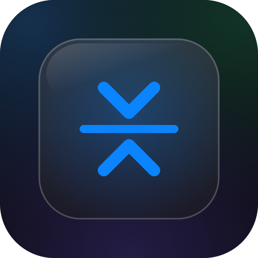

<p align="center">
  
</p># media-compress — 上傳前壓縮圖片與影片

[English](#english) | [繁體中文](#繁體中文)

Browser-side compression for images (WebP) and videos (480p H.264 via
WebCodecs) before upload — small enough to be crisp on a phone, tiny enough to
save storage and load instantly. Always falls back to the original file when
compression isn't possible, so it never blocks an upload, and tells you why via
`onInfo`.

---

## English

### Why

- **Images** → high-quality WebP (longest edge ≤ 1600, q0.85). GIF passes through.
- **Videos** → 480p H.264 MP4 (~1.4 Mbps + AAC) using **WebCodecs** — no 30 MB
  ffmpeg.wasm, no COOP/COEP cross-origin isolation needed. (480p is plenty for a
  phone-sized player; bump `height`/`bitrate` for sharper.)
- **Graceful fallback**: no WebCodecs (old iOS/Firefox), can't encode, or the
  result isn't smaller → returns the original file untouched. `onInfo` reports
  whether it compressed and, if not, why.

### Install

```jsonc
// pin a commit SHA (this ecosystem's convention)
"dependencies": { "media-compress": "github:lp250isme/media-compress#<sha>" }
```

For no-bundler pages, load the bundled ESM straight from jsDelivr:

```js
const { compressMedia } = await import(
  "https://cdn.jsdelivr.net/gh/lp250isme/media-compress@<sha>/dist/index.js"
);
```

### Use

```js
import { compressMedia } from "media-compress";

// auto-detects image vs video; returns a File (compressed or original)
const out = await compressMedia(file, {
  onProgress: (p) => console.log(Math.round(p * 100) + "%"), // video only, 0–1
  onInfo: (i) => console.log(i.compressed ? `${i.fromBytes}→${i.toBytes}` : i.reason),
});
// then upload `out`
```

`compressImage(file, opts)` / `compressVideo(file, opts)` are also exported.

### Options

```ts
{
  maxDim?: number;       // image longest edge, default 1600
  quality?: number;      // image WebP quality 0–1, default 0.85
  height?: number;       // video max height, default 480
  bitrate?: number;      // video bits/sec, default 1_400_000
  audioBitrate?: number; // video audio bits/sec, default 128_000
  onProgress?: (p: number) => void; // video transcode progress, 0–1
  onInfo?: (i: { compressed: boolean; reason?: string; fromBytes?: number; toBytes?: number }) => void;
}
```

`onInfo.reason` (when not compressed): `no-webcodecs` · `cannot-encode` ·
`not-smaller` · `error` · `not-video` / `not-image`.

### Notes

- WebCodecs video encode needs Chrome/Edge/Android or **Safari/iOS 16.4+**;
  elsewhere video falls back to the original.
- Bundle is ~128 KB gzipped (mediabunny inlined), best loaded lazily — e.g.
  `await import('media-compress')` only when the user actually uploads.

---

## 繁體中文

### 為什麼

- **圖片** → 高品質 WebP(最長邊 ≤ 1600、q0.85)。GIF 原樣不動。
- **影片** → 用 **WebCodecs** 轉 480p H.264 MP4(~1.4 Mbps + AAC)——不用 30 MB
  的 ffmpeg.wasm,也不用 COOP/COEP 跨來源隔離。(480p 對手機尺寸的播放器綽綽有餘;
  想更銳利就調大 `height`/`bitrate`。)
- **安全退路**:沒有 WebCodecs(舊 iOS/Firefox)、無法編碼、或壓完反而更大 →
  一律回原檔,絕不擋上傳;`onInfo` 會回報壓了沒、沒壓的話為什麼。

### 安裝

```jsonc
// 釘 commit SHA(本生態系慣例)
"dependencies": { "media-compress": "github:lp250isme/media-compress#<sha>" }
```

無打包器的頁面,直接從 jsDelivr 載打包好的 ESM:

```js
const { compressMedia } = await import(
  "https://cdn.jsdelivr.net/gh/lp250isme/media-compress@<sha>/dist/index.js"
);
```

### 使用

```js
import { compressMedia } from "media-compress";

// 自動判斷圖片/影片;回傳 File(壓好的或原檔)
const out = await compressMedia(file, {
  onProgress: (p) => console.log(Math.round(p * 100) + "%"), // 僅影片,0–1
  onInfo: (i) => console.log(i.compressed ? `${i.fromBytes}→${i.toBytes}` : i.reason),
});
// 接著上傳 out
```

也另外匯出 `compressImage(file, opts)` / `compressVideo(file, opts)`。

### 選項

```ts
{
  maxDim?: number;       // 圖片最長邊,預設 1600
  quality?: number;      // 圖片 WebP 品質 0–1,預設 0.85
  height?: number;       // 影片最大高度,預設 480
  bitrate?: number;      // 影片位元率 bits/sec,預設 1_400_000
  audioBitrate?: number; // 影片音訊 bits/sec,預設 128_000
  onProgress?: (p: number) => void; // 影片轉檔進度,0–1
  onInfo?: (i: { compressed: boolean; reason?: string; fromBytes?: number; toBytes?: number }) => void;
}
```

`onInfo.reason`(沒壓到時):`no-webcodecs`(瀏覽器不支援)· `cannot-encode`
(裝置無法編碼 H.264)· `not-smaller`(原檔已夠小)· `error` · `not-video`/`not-image`。

### 注意

- 影片編碼需 Chrome/Edge/Android 或 **Safari/iOS 16.4+**;其餘環境影片自動回原檔。
- 打包約 128 KB(gzip,已內含 mediabunny),建議延後載入——例如使用者真的要上傳時才
  `await import('media-compress')`。

---

## More by kv

[kvcc.me](https://kvcc.me) · 更多小工具與作品。

## License

MIT © kv · 影片轉碼底層為 [mediabunny](https://mediabunny.dev)(MPL-2.0 / 見其授權)。
